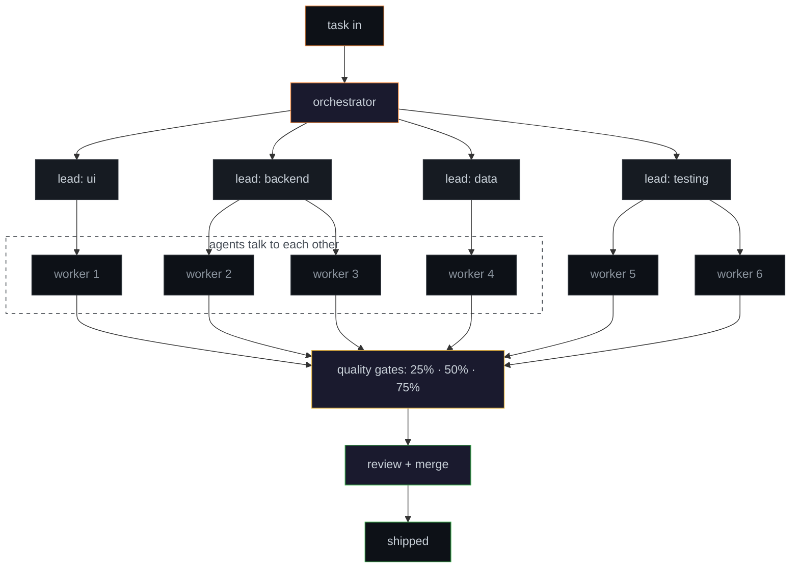

<p align="center">
  
</p>

i build autonomous systems that think, negotiate, and act. multi-agent orchestration, on-device SLMs, and tools that actually replace manual work. half my job is prompt engineering. the other half is arguing with a model that's confidently wrong and won't back down. it's like pair programming with someone who read every book but wrote zero code.

<br>

### what i'm working on

**[intentia](https://intentia.ai)** · matchmaking protocol for biotech and CDMOs. autonomous agents that discover, negotiate, and transact at network scale. hybrid SLM framework for on-device reasoning with reliability constraints. basically tinder for pharma, but the agents swipe for you and they never ghost.

**[Intent](https://github.com/IntentAi)** . privacy-first communication platform for everyone who values their privacy and system resources. Built with gamers as the priority, but designed for any community that refuses to trade data for features. Nexus is a Discord alternative where privacy isn't a promise, it's the architecture. The system literally cannot see your private conversations. No facial recognition. No government ID uploads. No surveillance disguised as safety. One you can verify, fork, and control

**[heft](https://github.com/0xSaiNova/heft)** · disk space auditor that actually understands dev toolchains. one command to see where your gigabytes went. it knows the difference between a 4GB cargo target dir and a 4GB photo library. tracks snapshots over time so you can see what grew back after you cleaned up. also rust.

**[keyheat](https://github.com/0xSaiNova/keyheat)** · terminal tool that tracks your keystrokes, WPM, typing trends, and shortcuts in real-time. built in rust. your keyboard has a story, this reads it. yes i built a keylogger on myself. no i will not elaborate.

**multi-agent orchestration** · hierarchical system where agents don't just execute, they plan, delegate, consult each other, and self-correct. three tiers of *trust but verify* with human-supervised quality gates because i've seen what an unsupervised agent does with `sudo` privileges and i don't want to talk about it.



automated model selection (claude / gemini / codex) per task, token budgets with hard caps, parallel execution across isolated git worktrees, and dangerous-op detection that escalates to a human before anything destructive runs. because `rm -rf /` shouldn't be a creative decision made by a model at 3am.

<br>

### things i learned building with LLMs that no docs will tell you

```
╔══════════════════════════════════════════════════════════════════════╗
║                                                                      ║
║  never ask an LLM "are you sure?"                                    ║
║  it'll say yes. every time. make it argue against itself.            ║
║                                                                      ║
╠══════════════════════════════════════════════════════════════════════╣
║                                                                      ║
║  context window ≠ understanding window                               ║
║  200K in ≠ 200K understood. CLI overhead eats 6-9%.                  ║
║  ran 208 reqs, 18.6M tokens, 80.7% were cache reads.                ║
║  most tokens aren't thinking, they're remembering.                   ║
║                                                                      ║
╠══════════════════════════════════════════════════════════════════════╣
║                                                                      ║
║  sandbox everything. trust nothing.                                  ║
║  an agent will nuke your codebase out of confidence.                 ║
║  isolated worktrees. destructive ops get escalated.                  ║
║  treat it like an intern with root access.                           ║
║                                                                      ║
╠══════════════════════════════════════════════════════════════════════╣
║                                                                      ║
║  never let the student grade their own homework                      ║
║  every quality gate uses a different model to verify.                ║
║                                                                      ║
╚══════════════════════════════════════════════════════════════════════╝
```

<br>

### tools i think with

```
languages     python · rust · typescript · javascript · sql
frontend      astro · react · html · css · tailwind
ml            pytorch · transformers · scikit-learn · langchain · embeddings · RAG
agents        multi-agent orchestration · MCP tool-use · prompt engineering · RLVR
infra         docker · azure · postgresql · mongodb · redis · anthropic sdk
```

<br>

### the tldr

- **[intentia](https://intentia.ai)** · co-founder. matchmaking protocol for biotech/CDMOs. agents that discover and transact autonomously.
- **6 AI agents** orchestrated across UI, backend, data, and testing with automated quality gates
- **automation engineering** · turned a $500/4-week manual process into $30/24hrs
- **autonomous trading system** · transformer + RLHF + real P&L as reward signal. self-funded tuition from profits.

<br>

if any of this sounds interesting or you want to argue about agent architectures, [dm me on linkedin](https://www.linkedin.com/in/saisaranu/). i respond faster than my agents. lower hallucination rate too.

<p align="center">
  <a href="mailto:sai.saranu1@gmail.com"></a>
  <a href="https://www.linkedin.com/in/saisaranu/"></a>
  <a href="https://intentia.ai"></a>
</p>

<p align="center">
  
</p>
