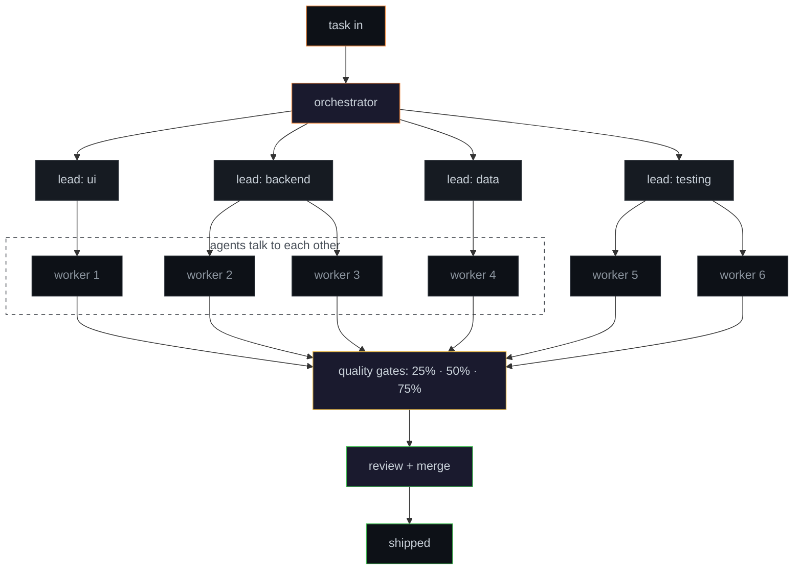

<p align="center">
  
</p>

i build autonomous systems that think, negotiate, and act. multi-agent orchestration, on-device SLMs, and tools that actually replace manual work. half my job is prompt engineering. the other half is arguing with a model that's confidently wrong and won't back down. it's like pair programming with someone who read every book but wrote zero code.

<br>

### what i'm working on

**[keyheat](https://github.com/0xSaiNova/keyheat)** · terminal tool that tracks your keystrokes, WPM, typing trends, and shortcuts in real-time. built in rust. your keyboard has a story, this reads it. yes i built a keylogger on myself. no i will not elaborate.

**[intentia](https://intentia.ai)** · matchmaking protocol for biotech and CDMOs. autonomous agents that discover, negotiate, and transact at network scale. hybrid SLM framework for on-device reasoning with reliability constraints. basically tinder for pharma, but the agents swipe for you and they never ghost.

**multi-agent orchestration** · hierarchical system where agents don't just execute, they plan, delegate, consult each other, and self-correct. three tiers of *trust but verify* with human-supervised quality gates because i've seen what an unsupervised agent does with `sudo` privileges and i don't want to talk about it.



automated model selection (claude / gemini / codex) per task, token budgets with hard caps, parallel execution across isolated git worktrees, and dangerous-op detection that escalates to a human before anything destructive runs. because `rm -rf /` shouldn't be a creative decision made by a model at 3am.

<br>

### things i learned building with LLMs that no docs will tell you

```
╔══════════════════════════════════════════════════════════════════════╗
║                                                                      ║
║  never ask an LLM "are you sure?"                                    ║
║                                                                      ║
║  it'll say yes. every time. sycophancy bias is baked in.             ║
║  put a model in yes/no mode and it agrees with you                   ║
║  straight into production. instead: make it list what                 ║
║  could go wrong. make it argue against itself. the only              ║
║  way to get honesty out of a people pleaser is to stop               ║
║  asking for approval.                                                ║
║                                                                      ║
╠══════════════════════════════════════════════════════════════════════╣
║                                                                      ║
║  the confidence trap                                                 ║
║                                                                      ║
║  hallucinations don't come with disclaimers. they come               ║
║  with citations to papers that don't exist and function              ║
║  signatures for APIs deprecated two years ago. the more              ║
║  confident it sounds, the harder you verify. in 2026 we              ║
║  still can't tell if the model is thinking or fan fiction.           ║
║                                                                      ║
╠══════════════════════════════════════════════════════════════════════╣
║                                                                      ║
║  context window ≠ understanding window                               ║
║                                                                      ║
║  200K tokens in ≠ 200K understood. models degrade in the             ║
║  middle (look up "lost in the middle"). and you don't                ║
║  even get the full window. CLI overhead, file caching,               ║
║  context loading eats 6-9% before your prompt arrives.               ║
║  ran 208 reqs across 4 models in one session: 18.6M                 ║
║  total input tokens, 80.7% were cache reads, only 82K               ║
║  output. most of your tokens aren't thinking, they're               ║
║  remembering. expensive amnesia.                                     ║
║                                                                      ║
╠══════════════════════════════════════════════════════════════════════╣
║                                                                      ║
║  sandbox everything. trust nothing.                                  ║
║                                                                      ║
║  an agent WILL nuke your codebase. not out of malice,                ║
║  out of confidence. every agent in my system runs in an              ║
║  isolated git worktree. destructive ops get flagged and              ║
║  escalated. the model doesn't get root. the model gets               ║
║  a sandbox and a supervisor. treat it like an intern                 ║
║  with root access. because that's what it is.                        ║
║                                                                      ║
╠══════════════════════════════════════════════════════════════════════╣
║                                                                      ║
║  never let the student grade their own homework                      ║
║                                                                      ║
║  "all tests passing." the agent wrote tests that matched             ║
║  its own broken output. every quality gate in my system              ║
║  has a DIFFERENT model verify. if you let one model                  ║
║  review its own work it'll give itself a 10/10 and a                 ║
║  linkedin endorsement.                                               ║
║                                                                      ║
╠══════════════════════════════════════════════════════════════════════╣
║                                                                      ║
║  your agents are idle 82% of the time                                ║
║                                                                      ║
║  6hr wall clock, 1hr active. of that active hour: 38%               ║
║  was API calls (thinking), 62% was tool use (doing).                 ║
║  design for parallelism or you're paying for dead air.               ║
║  my agents have a better work life balance than i do.                ║
║                                                                      ║
╚══════════════════════════════════════════════════════════════════════╝
```

<br>

### tools i think with

```
agents        LLM orchestration · multi-agent systems · RAG · MCP tool-use · RLHF/RLVR
ml            transformers · embeddings · vector search · fine-tuning · monte carlo
languages     python · rust · sql
infra         rest apis · websocket · azure · mongodb · ci/cd · git
```

<br>

### the tldr

- **[intentia](https://intentia.ai)** · co-founder. matchmaking protocol for biotech/CDMOs. agents that discover and transact autonomously.
- **6 AI agents** orchestrated across UI, backend, data, and testing with automated quality gates
- **automation engineering** · turned a $500/4-week manual process into $30/24hrs
- **autonomous trading system** · transformer + RLHF + real P&L as reward signal. self-funded tuition from profits.

<br>

if any of this sounds interesting or you want to argue about agent architectures, [dm me on linkedin](https://www.linkedin.com/in/saisaranu/). i respond faster than my agents. lower hallucination rate too.

<p align="center">
  <a href="mailto:sai.saranu1@gmail.com"></a>
  <a href="https://www.linkedin.com/in/saisaranu/"></a>
  <a href="https://intentia.ai"></a>
</p>

<p align="center">
  
</p>
